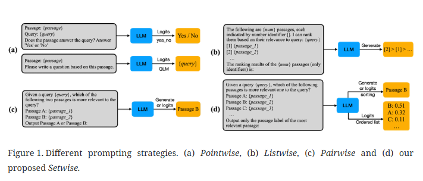

### RAG-检索增强生成技术

#### A Setwise Approach for Effective and Highly Efficient Zero-shot
Ranking with Large Language Models --------一种利用大型语言模型实现高效且极具效率的零样本排序的集合方法

本质是基于Pairwise prompting approaches 的算法升级，提出的 Setwise Approach. 

其中本文说明了三种零样本排序算法，1）Pointwise-点式 ，2）Listwise-列表式 ，3）Pairwise-成对式

这些算法的目标为在一堆文档中选择与查询最相关的文档- select the most relevant document to the query from a set of candidate documents.

#### WALKING DOWN THE MEMORY MAZE: BEYONDCONTEXT LIMIT THROUGH INTERACTIVE READING-------漫步记忆迷宫：通过交互式阅读突破上下文限制

本文提出了**MEMWALKER**技术，其思想为，将长文本分割成预先设定大小的segment，将segment的内容通过LLM()得出片段的总结摘要，将segment的首次摘要做为叶子节点，再通过LLM得出父节点，做成MemoryTree，再通过检索MemoryTree 得出与查询最相关的节点，再LLM()得出answer。

缺陷在于，可能有更高效的数据结构去充当MemoryTree。