### 图像处理

#### 什么是数字图像处理

1**计算机视觉**本身是人工智能(AI)的一个分支， 其目的是**模仿人类智能**。

2图像分析（也称图像理解）领域则处在图像处理和计算机视觉之间。

3计算机处理有三类，即**初级、中级、高级**

​	初级：降低噪声的**图像预处理、对比度增强和图像锐**化。低级处理由其输入和输出都是图像的事实来表征。

​	中级：分割，将目标简化为适合计算机进行处理的形式的描述，以及各个目标的分类**input=image ，	output=feature。**

​	高级：涉及“理解”在连选体远端位置识别的一组目标，以及执行通常与人类视觉相关的认知功能。

4数字图像处理界定为其输入和输出都是图像的处理。

#### 数字图像处理的起源

早期的巴特兰系统可以用5个不同的灰度级来编码图像

医学影像中的**CT学名为计算机轴向断层成像**

**数字图像处理技术**可用于**求解机器感知问题**，机器感知中所用的这种信息是**统计矩、傅里叶变换系数和多维距离测度。**

**机器感知**中的典型问题有**自动字符识别**、**产品组装**和**检验的工业机器视觉**、**军事保障**、**指纹的自动处理**、**X射线筛查和血样抽样**、用于**天气预报**和**环境评估的航空**与**卫星图像的机器处理**。

#### 数字图像应用领域

如今，所用的主要图像源是电磁波谱，其他重要的图像包括声波、超声波和电子

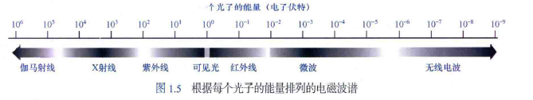

1.伽马射线成像的主要用途包括核医学和天文观测。PET学名为正电子放射断层成像。

2.可见光处理的主要应用领域有遥感，遥感通常包括可见光和红外波谱范围内的一些波段。

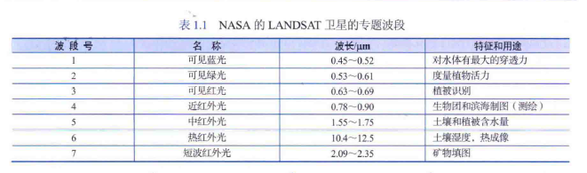

3.**可见光谱成像**的一个主要应用领域是**制成品的自动视觉检测**。

4.**微波波段成像**的主要应用是**雷达**。

5.**无线电波段成像**主要用途包括**医学和天文学**。**医学中无线电波用于磁共振（MRI）**

6.**图像增强**是对图像进行某种操作，使结果在**特定应用中比原图像更为合适的过程**

7.**图像复原**也是改进图像外观的一个领域。然而，**图像增强是主观的，而图像复原是客观的**；在某 种意义上说，复原技术倾向于以图像退化的数学或概率模型为基础，而增强技术以好的增强效果这种主观偏好为基础。

8.**压缩**是指**减少图像存储址或降低传输图像的带宽的处理**。

9.形态学处理是提取图像中用于表示和描述形状的成分的处理工具

10.分割将一幅图像划分为各个组成部分或目标。通常，自动分割是数字图像处理中最困难的任务之 一。

11.**特征提取几乎总是在分割阶段的输出的后面出现**，特征提取包括**特征检测和特征描述**

12.图像模式分类是指根据目标特征描述子对目标赋予标记（如“车辆＂）的过程

####  图像处理系统的组成

获取数字图像需要两个子系统。第一个子系统是**物理传感器**，其作用是**对成像目标辐射的能力产生响应**。第二个子系统是**数字化仪**，其作用是**把物理感知设备的输出转换为数字形式**。

#### 图像取样和量化

要产生一幅数字图像，就需要把连 续感测的数据转换为数字形式。这种转换包括两种处理：取样和量化。

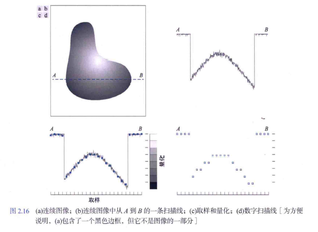

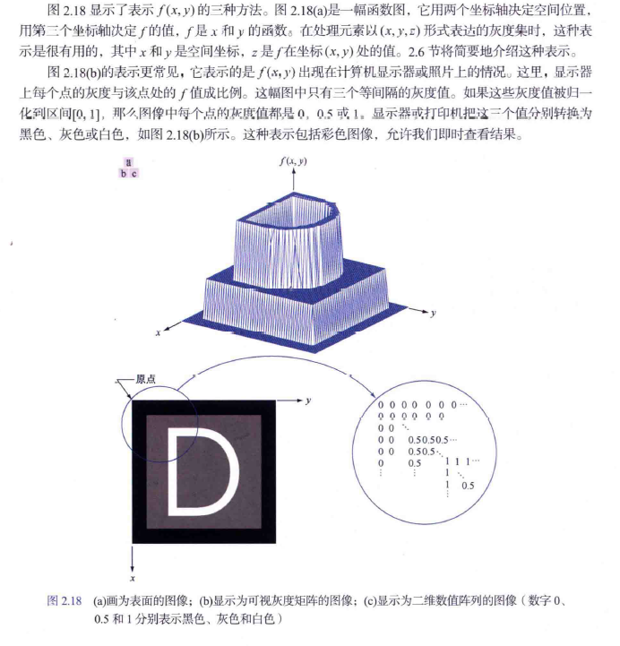

**灰度跨越的值域称为动态范围**，这一术语在不同场合的用法不同。这里，我们将图像系统 的动态范围定义为系统中最大可度量灰度与最小可检测灰度之比。**通常，上限取决于饱和度，下限取 决于噪声**，但噪声也会出现在较亮的灰度中。

动态范围建立一个系统所能表示和一幅图像所具有的最低和最高灰度级。与这一概念紧密相关的是图像对比度，它定义为一幅图像中最高和最低灰度级间的灰度差。**反差比是这两个量的比率**。**一幅图像中的可观像素数量具有高动态范围时，我们称该图像具有高对比度。相反，具有低动态范围的图像看起来通常很灰暗。**

#### 空间分辨率和灰度分辨率

在美国，这一测度通常使用**点数／英寸(dpi)**表示

如降低分辨率，为提高清晰度可用**内插法**。内插通常在**图像放大、缩小、旋转和几何校正**等任务中使用。内插是用已知数据来估计未知位置的值的过程。一种简单的放大方法是，找到最接近的像素进行像素插入，当会失真。

1.**双线性内插**： 令**v(x,y)表示灰度值。x,y,为二维坐标**，对于双线性内插而言，所赋的值由如下 公式得到：
$$
v(x,y) =ax+by+cxy+d
$$
式中，**4个系数可用由点(x,y)的4个最近邻点写出的4个未知方程求出**。双线性内插的结果要比最近 邻内插的结果好得多，但计算掀会随之增大。

2.双三次内插：它包括16个最近邻点。赋给点(x,y)的灰度值由如下公式得到：
$$
v(x,y)=\sum_{i=0}^{3}\sum_{j=0}^{3}a_{ij}x_{}^{i}y_{}^{j}
$$
双三次内插是商用图像编辑程序如Adobe Photoshop和Corel Photopaint中使用的标准内插方法

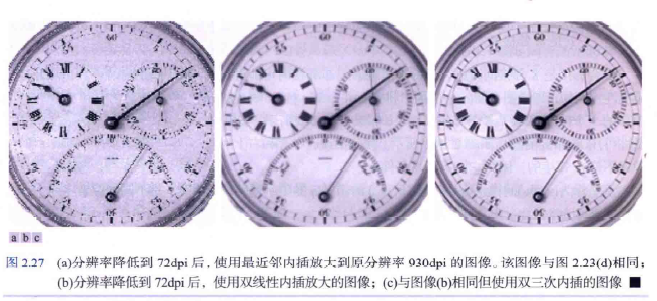

####  像素间的一些基本关系(图像领域) 参考链接：[图像处理：像素间的一些基本关系（领域、领接性、通路、连通分量、距离）_m邻接-CSDN博客](https://blog.csdn.net/weixin_45965683/article/details/115459476)

1.**相邻像素——4邻域**

- 4邻域：像素p(x,y)的4邻域是： (x+1,y)；(x-1,y)；(x,y+1)；(x,y-1)
- 用 $ N_{4}(p)$ 表示像素p的4邻域 ：

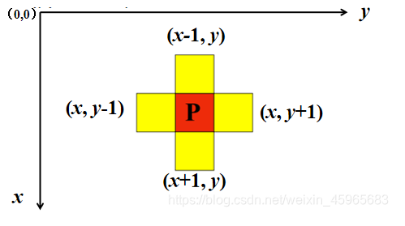

2.**相邻像素——D邻域**

- D邻域（ diagonal ）定义：像素p(x,y)的D邻域是：对角上的点 (x+1,y+1)；(x+1,y-1)；(x-1,y+1)；(x-1,y-1)
- 用$N_D(p）$表示像素p的D邻域 

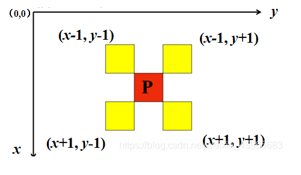

3.**相邻像素——8邻域**

- 8邻域定义：像素p(x,y)的8邻域是：4邻域的点 ＋ D邻域的点
- 用$N_8(p)$表示像素p的8邻域。$N_8(p）= N_4(p）+ N_D(p）$

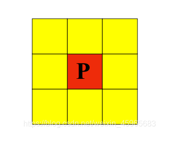

4.如果一个领域包含$p$,那么称该领域为闭领域，否则称该领域为开领域。

5.邻接性

- 邻接性是描述区域和边界的重要概念
- 两个像素邻接的两个必要条件是：
  **两个像素的位置是否相邻**
  **两个像素的灰度值是否满足特定的相似性准则（或者是否相等）**

6.**像素间的邻接性——4邻接**

- 对于具有值V的像素p和q，如果q在集合$N_4(p)$中，则称这两个像素是4邻接的。

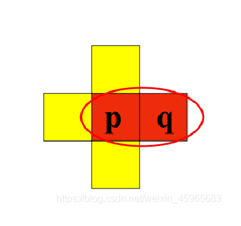

7.**像素间的邻接性——8邻接**

- 对于具有值V的像素p和q，如果q在集合$N_8(p)$中，则称这两个像素是8邻接的 。

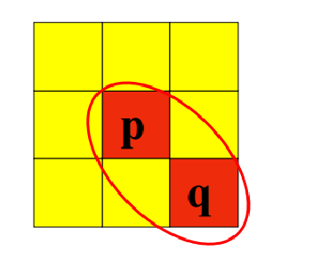

8.**像素间的邻接性——m邻接**

对于具有值V的像素p和q，如果:

- q在集合$N_4(p)$中，或
- q在集合$N_D(p)$中，并且$N_4(p)$与$N_4(q)$的交集为空（没有值V的像素）。则称这两个像素是m邻接的，即4邻接和D邻接的混合连通

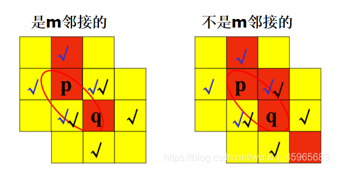

9.**m邻接可消除8邻接产生的二义性**

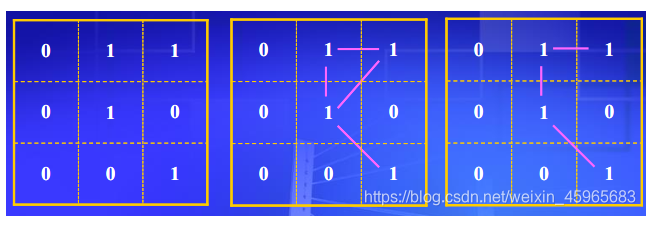

在图2中，8邻域中的中间的那个1可以有**两条路**到达右上角的那个1，**这就是所说的二义性**，这个情况在边缘检测里面是很不希望的。
如图3所示，改成m邻域以后，中间的1像素和右上角的像素是8连通的却不是m连通的，这可以从m连通的定义得到，如果用M连通从中间的1到右上角的1就只有一条路。

10.**像素间的邻接性关系：**

| 若p和q是4邻接，那么它们肯定是8邻接？ | 对   |
| ------------------------------------ | ---- |
| 若p和q是8邻接，那么它们肯定是4邻接？ | 错   |
| 若p和q是4邻接，那么它们肯定是m邻接？ | 对   |
| 若p和q是m邻接，那么它们肯定是4邻接？ | 错   |
| 若p和q是8邻接，那么它们肯定是m邻接？ | 错   |
| 若p和q是m邻接，那么它们肯定是8邻接？ | 错   |

11.通路

| 若p和q之间存在4通路，则两者之间必存在m通路 | 对   |
| ------------------------------------------ | ---- |
| 若p和q之间存在m通路，则两者之间必存在4通路 | 错   |
| 若p和q之间存在m通路，则两者之间必存在8通路 | 对   |
| 若p和q之间存在8通路，则两者之间必存在m通路 | 对   |
| 若p和q之间存在8通路，则两者之间必存在4通路 | 错   |
| 若p和q之间存在4通路，则两者之间必存在8通路 | 对   |

12.连通分量

令S是图像中的一个像素子集。如果在S中全部像素之间存在一个通路，则可以说p和q在S中是连通（connected）的。对于S中的任何像素p，S中连通到该像素的像素集称为S的连通分量。如果S仅有一个连通分量，则集合S称为连通集(connected set)。

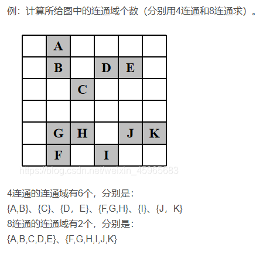

**邻接区域**：令R表示图像中像素的一个子集。若R是一个连通集，则称R为图像的一个区域。两个区域$R_i$和$R_j$联合形成一个连通集时，称$R_i$和$R_j$为邻接区域。不邻接的区域称为不相交区域。谈到区域时，我们考虑的是4邻接和8邻接。为使我们的定义有意义，必须指定所用邻接的类型。例如，仅在使用 8邻接时，如图中的两个1值区域才是邻接的（根据前一段的定义，两个区域之间不存在4通路， 因此它们的并集不是连通集）

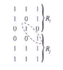

**图像前景与背景**：假设一幅图像含有$K$个不相交的区域$R_k,k = 1,2,···, K,$并且它们都不与图像边界相接。令$R_u$表示所有$K$个区域的并集，并且令$(R_u)^c$表示其补集（回顾可知，集合A的补集是不在A中的点的集合）。 我们称$R_u$中的所有点为图像的前景，而称$(R_u)^c$中的所有点为图像的背景。

**区域边界**：区域R的边界（也称边框或轮廓）是R中与R的补集中的像素相邻的一组像素。换句话说，一个区域的边界是该区域中至少有一个背景邻点的像素集。这里，**我们必须再次指定用于定义邻接的连通**。 例如，如果在区域及其背景之间使用4连通，那么如图中加圆的点就不是1值区域边界的成员， 因为这个点和背景之间唯一可能的连接是对角线。为处理这种情况，一个区域及其背景中的点之间的邻接通常用8连通来定义。

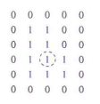

前面的定义有时称为区域的内边界，以便与其外边界区分，外边界是背景中的对应边界。在**开发跟踪边界**的算法时，这一区别很重要。这种箕法为了保证结果形成一个闭合通路，通常是沿外边界表 达的。例如，图中，1值区域的内边界是该区域本身。这一边界并不满足闭合通路的定义。另一方面，该区域的外边界确实形成了一个围绕该区域的闭合通路。

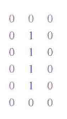

**距离测度**：距离的测量使用欧几里得（欧氏）距离，其定义为
$$
D_e(p,q)=\sqrt{(x-u)^2+(y-v)^2}
$$
$p与q$之间的距离$D_4$定义为
$$
D_4(p,q)=|x-u|+|y-v|
$$
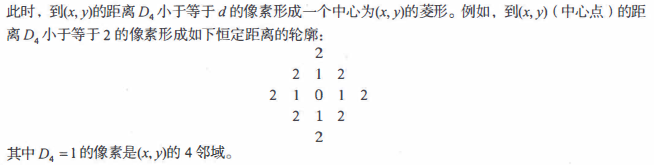

$p与q$之间的距离$D_8$定义为
$$
D_4(p,q)=max(|x-u|,|y-v|)
$$
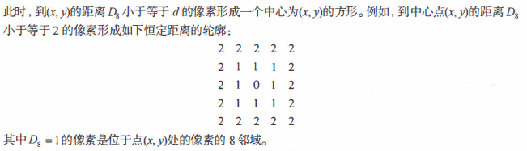
